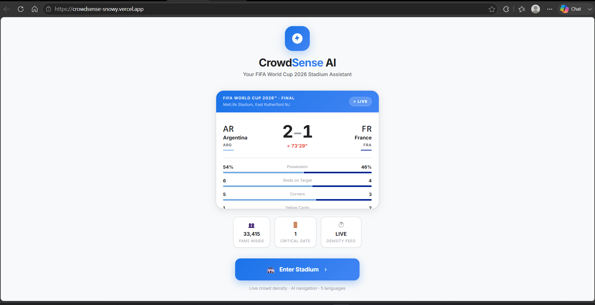
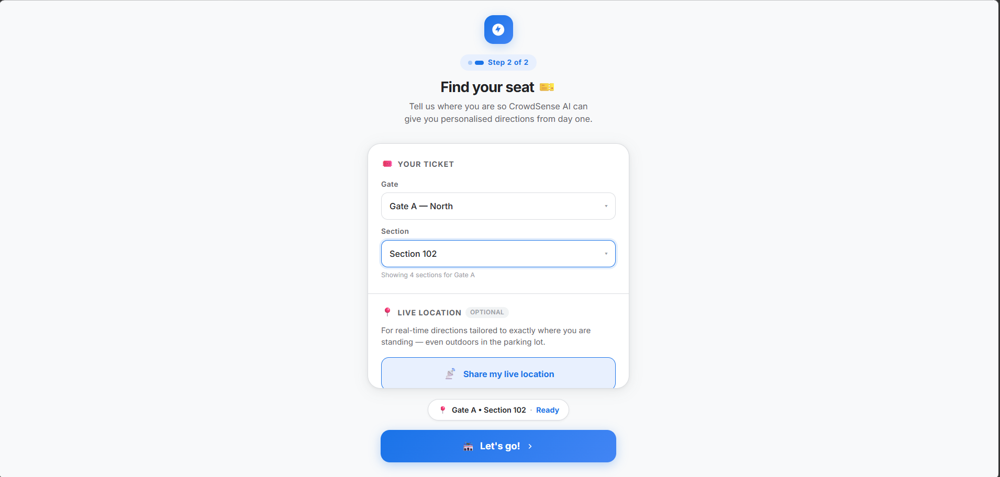
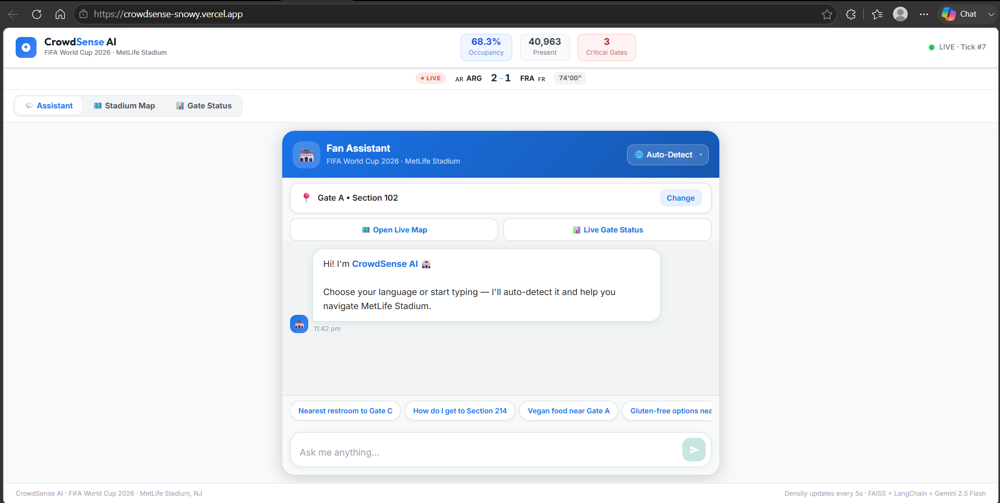
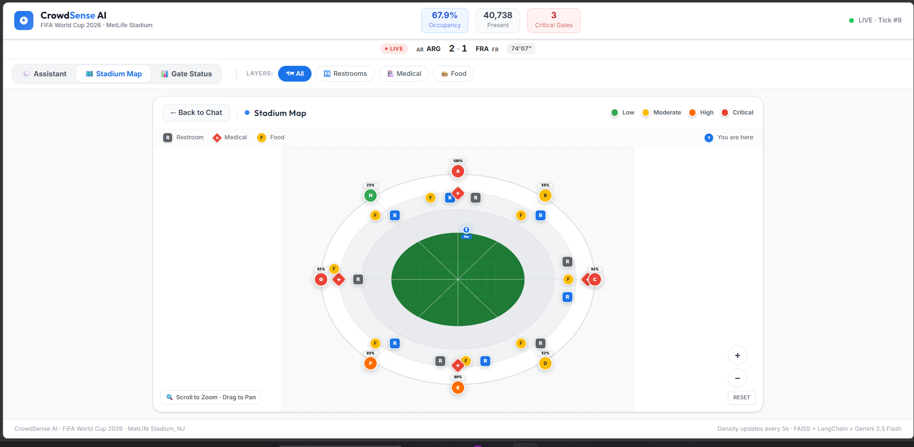
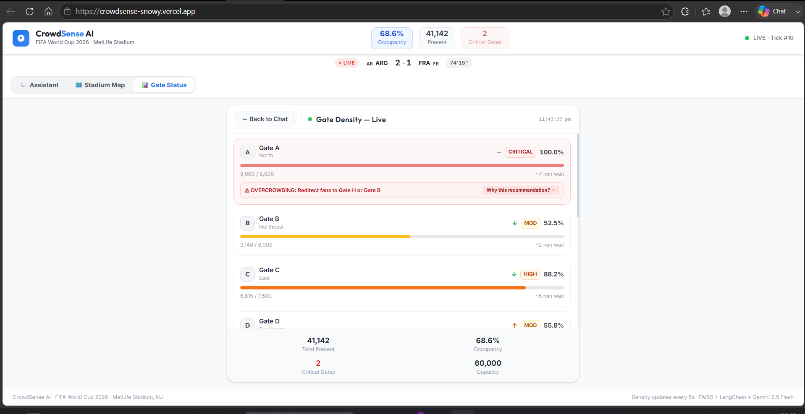

# CrowdSense AI — FIFA World Cup 2026™ Stadium Assistant

**Every stadium is a temporary city. CrowdSense AI helps it run like one.**

A multilingual, GenAI-powered fan navigation and crowd intelligence assistant built for MetLife Stadium during the FIFA World Cup 2026 — designed to reason across live crowd data, stadium geometry, and match timing to solve real operational problems, not just answer questions.

Built for **PromptWars Virtual — Challenge 4: Smart Stadiums & Tournament Operations**.

---

## 🔗 Live Demo & Links

- **Live App**: [https://crowdsense-snowy.vercel.app/]
- **Backend API Docs**: [(https://crowdsense-backend-i8b3.onrender.com/docs)]/docs
- **Repository**: [https://github.com/Lakshita0901/crowdsense]

> **Persona:** Fans &nbsp;|&nbsp; **Verticals:** Navigation & Crowd Management, Multilingual Assistance

---

## 1. Problem Statement & Challenge Alignment

During massive events like the FIFA World Cup 2026, stadium ingress and egress present significant logistics challenges. MetLife Stadium hosts up to 60,000 fans, leading to localized gate congestion, long queues, and confusion — especially for international visitors facing language barriers or dietary/accessibility needs.

Most stadium apps solve this with a static map and a generic chatbot. CrowdSense AI instead treats the stadium as a connected system: a single fan query triggers reasoning across **three live data sources** — floorplan geometry, real-time gate density, and match clock — before generating a response, and every recommendation shows its reasoning rather than acting as a black box.

**Every feature maps directly to the challenge brief:**

| Brief Requirement | CrowdSense AI Feature |
|---|---|
| Navigation & Crowd Management | Density-aware rerouting, route-load-balancing so fans aren't all sent the same way |
| Multilingual Assistance beyond translation | 5-language support with formal, tourist-appropriate tone/register adaptation |
| Locating specific food options (Fans persona example) | Dietary-aware food discovery (vegan, gluten-free, halal) |
| Explainable AI | Every recommendation includes a real, data-derived "Why" reasoning line |
| Intent-driven, AI-assisted orchestration | Multi-source LLM reasoning across FAISS + live density + match clock in a single response |

---

## 2. Application Preview

### Live Match Landing

The entry point shows a simulated live FIFA World Cup 2026 match feed, setting context before the fan even enters the app.

### Ticket & Location Setup

Fans enter their Gate/Section or share live GPS location for personalized routing from the first screen.

### Multilingual AI Assistant

Auto-detects the fan's language and responds with warm, tourist-appropriate tone — not just literal translation.

### Interactive Stadium Map

Live gate status, amenity markers, and route visualization from the fan's current position to their destination.

### Live Gate Density & XAI Reasoning

Every overcrowding alert includes an expandable "Why this recommendation?" breakdown backed by real occupancy data.

---


## 3. Architecture

```
                 +-----------------------+
                 |     React Frontend    | <---+ (Polls live status 5s)
                 +-----------+-----------+
                             | (Sends chat query / coordinates)
                             v
                 +-----------------------+
                 |    FastAPI Backend    |
                 +-----------+-----------+
                             |
         +-------------------+-------------------+
         | (Spatial context) | (Live counts)     | (Surge rules)
         v                   v                   v
   +-----------+     +---------------+     +-----------+
   | FAISS RAG |     | Gate Density  |     | Match     |
   | Index     |     | Snapshot      |     | Clock     |
   +-----+-----+     +-------+-------+     +-----+-----+
         |                   |                   |
         +-------------------+-------------------+
                             |
                             v
                 +-----------------------+
                 | Gemini 2.5 Flash LLM  | (LangChain system instruction)
                 +-----------+-----------+
                             |
                             v
                 +-----------------------+
                 |  XAI Reasoning Layer  | (Extracts clean answer + "Why" line)
                 +-----------+-----------+
                             |
                             v
                 +-----------------------+
                 |  User Mobile Screen   | (Persisted via localStorage)
                 +-----------------------+
```
+-----------------------+
**Design principle:** deterministic logic and generative reasoning are deliberately separated. Crowd counters, gate adjacency, route-load decay math, and dietary filtering are all handled by plain backend code — the LLM's job is specifically *reasoning and natural language generation* on top of real, verified data. This avoids the LLM ever hallucinating a capacity number or a gate ID.

---

## 4. Repository Structure
```
crowdsense/
├── backend/
│   ├── main.py
│   ├── fan_chat.py
│   ├── indexer.py
│   ├── faiss_index/
│   ├── data/
│   └── tests/
├── frontend/
│   ├── src/
│   │   ├── components/
│   │   └── tests/
│   └── public/
├── screenshots/
├── LICENSE
├── SECURITY.md
├── CONTRIBUTING.md
└── README.md

```

## 5. Tech Stack

**Frontend**: React, Vite, TailwindCSS, Lucide icons
**Frontend Testing**: Vitest, React Testing Library, jsdom
**Backend**: FastAPI (Python), Uvicorn
**Vector Database**: FAISS (stadium layout + amenities index)
**Embeddings**: Gemini Embedding API
**LLM Pipeline**: LangChain + Gemini 2.5 Flash
**Backend Testing**: pytest, pytest-asyncio, HTTPX TestClient
**Deployment**: Vercel (frontend) + Render (backend)

---

## 6. AI Usage: AI-Assisted vs. Human-Designed

| Vertical / Feature | AI-Assisted (Gemini 2.5 Flash) | Human-Designed (Deterministic) |
|---|---|---|
| Natural Language Support | Language detection, native synthesis, tone adjustment | Mapping locale codes, register rules per language |
| Crowd Routing | Translating congestion levels into fan-friendly instructions | Gate capacities, adjacency indices, route-load decay counters |
| Vector Search | Semantically matching fan inquiries to stadium points | Indexing floor plans, coordinates, dietary tags |
| Surge Prediction | Phrasing pre-emptive warnings near match end | Comparing elapsed match time against surge thresholds |
| XAI Reasoning | Generating the natural-language "Why" explanation | Selecting which data points are relevant to explain |

**Product decisions made independently of AI:** persona/vertical scope selection, the decision to separate deterministic math from LLM reasoning, the chat-first UX flow (landing → ticket → chat → map handoff), route-load-balancing algorithm design, and the choice to surface reasoning visibly rather than hide it.

---

## 7. Explainable AI (XAI) — Worked Example

Explainability is a core pillar of CrowdSense AI. Every rerouting recommendation includes a dedicated `Why:` reasoning line, not just an instruction.

**Example flow:**
1. **Fan query**: *"Where do I enter for Section 101?"*
2. **Deterministic lookup**: Section 101's primary entrance is Gate A.
3. **Live congestion check**: Gate A is at **94% capacity** (Critical).
4. **Adjacency reasoning**: Gate H is nearest alternate, at **15% capacity** (Low).
5. **Generative synthesis**: Gemini generates the natural-language answer *and* the reasoning:
   > **Answer**: "For Section 101, please enter through Gate H and walk clockwise along the outer concourse."
   > **Why**: "Gate A is at 94% capacity right now, so I'm routing you through Gate H instead, which has almost no wait."

This same reasoning pattern also drives route-load-balancing: if a route has already been recommended to many fans in the last few minutes, the AI explains the alternate choice with real numbers, not a generic message.

---

## 8. Prompt Engineering Evidence

CrowdSense AI was built through an **iterative, intent-driven prompting process** — not a single generation pass. Each stage was tested and verified before the next prompt was issued:

`Core scaffold` → `Multilingual RAG chat` → `Multi-source reasoning (FAISS + density + match clock)` → `XAI reasoning layer` → `Route-load-balancing` → `Accessibility pass` → `Security hardening` → `Testing pass`

Real failures encountered and fixed along the way (kept here for transparency, not polish): a gate/section data-mismatch bug caught during manual testing, a conversation-memory gap where the assistant lost context between chat turns, and a Render free-tier memory limit that required switching from a local embedding model to the Gemini Embedding API.

---

## 9. Security

- **Secrets Sanitization**: API keys isolated to `.env` files, never committed
- **Input Sanitization**: Query length capped (500 chars), filtered against script injection and SQL-style payloads
- **Rate Limiting**: Rolling limit of 15 requests/minute per client
- **Graceful Fallback**: If `GOOGLE_API_KEY` is missing or the LLM call fails, the backend degrades to a readable, human-formatted keyword-ranked FAISS search — never raw internal data (coordinates, IDs) shown to the user

---

## 10. Accessibility

- **Semantic Markup**: Proper HTML5 elements, logical `tabIndex` ordering for full keyboard navigation
- **ARIA Labels**: All interactive elements (gate/section selectors, layer toggles, map markers, chat input) have descriptive `aria-label` attributes
- **Contrast**: All status badges and text verified against WCAG AA (≥4.5:1 contrast ratio)
- **Alt Text**: All visual markers and directional icons are screen-reader accessible
- **Multilingual Register Adaptation**: Responses use formal, respectful phrasing appropriate for international visitors (e.g. "usted" in Spanish, "vous" in French, "Sie" in German), not just literal translation

---

## 11. Session Persistence

Chat history and fan location persist across page navigation and refresh via browser `localStorage` — a fan can move between the Assistant, Stadium Map, and Gate Status views (or refresh the page) without losing their conversation. A "Start Over" option clears this and resets the session.

---

## 12. Local Setup

### Prerequisites
- Python 3.10+
- Node.js 18+

### Backend
```bash
cd backend
# Create .env from .env.example, add your GOOGLE_API_KEY
pip install -r requirements.txt
pip install -r requirements-dev.txt
python indexer.py
uvicorn main:app --reload --port 8000
```

### Frontend
```bash
cd frontend
npm install --legacy-peer-deps
npm run dev
```
Open `http://localhost:5173`.

---

## 13. Testing

```bash
# Backend
cd backend
.venv\Scripts\pytest -v

# Frontend
cd frontend
npm run test
```

**Coverage includes**: fan chat endpoint (valid queries + edge cases), FAISS-only fallback behavior, route-load-balancing decay logic, gate/section validation, multilingual response correctness, dietary filtering, onboarding flow, and map marker rendering.

---

## 14. Known Limitations

- **Simulated live data**: Match score/clock and crowd density are simulated, not sourced from real FIFA feeds — real-time stadium sensor and match data APIs are enterprise-licensed and inaccessible for a hackathon build
- **Indoor GPS**: Relies on section-to-coordinate interpolation, since concrete stadium structures attenuate real GPS signal indoors (a known limitation shared by real stadium nav systems)
- **Backend in-memory state**: Crowd density counters and route-recommendation decay reset on server restart (not backed by persistent storage in this prototype)
- **Free-tier hosting**: Backend cold-starts after inactivity (~50s delay) due to free-tier hosting constraints

---

## 15. Future Enhancements

- Production integration with real gate turnstile sensors
- Google Maps API handoff for outdoor approach navigation
- Ticket barcode scanning for automatic gate/section detection
- 3D stadium view
- Device-motion-based indoor "live tracker" (dead-reckoning navigation between manual check-ins)
- Persistent backend storage (Redis) for crowd/route state

---

## 16. License

MIT License — see [LICENSE](LICENSE)

## 17. Author

Built by **Lakshita** for PromptWars Challenge 4 (FIFA World Cup 2026 — Smart Stadiums & Tournament Operations), Hack2Skills.
